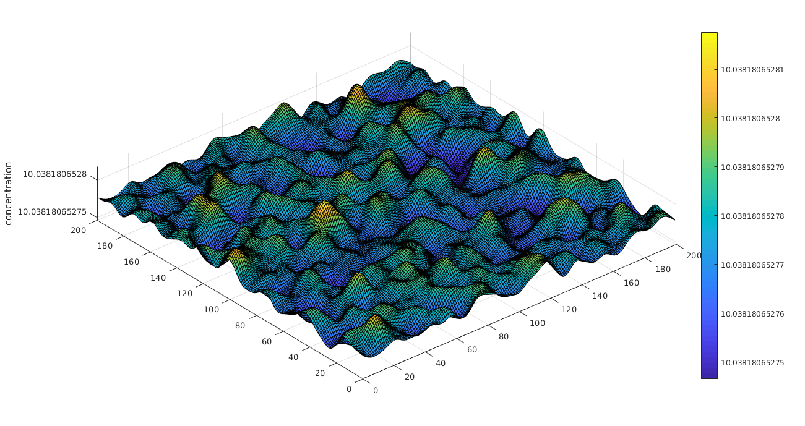
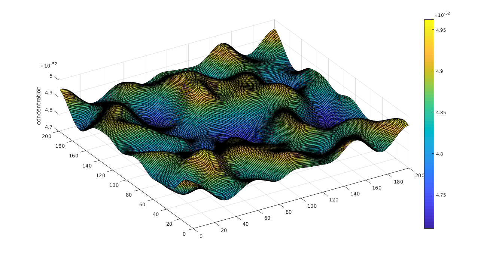
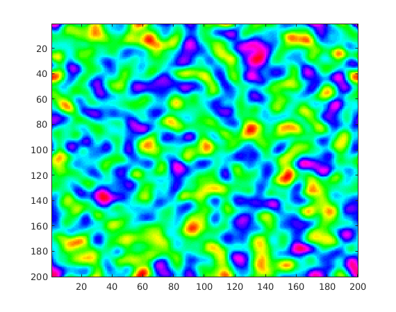
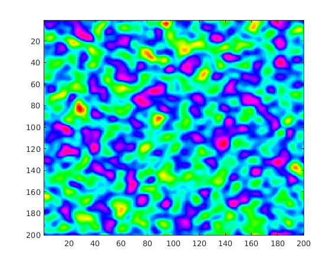

# Spatial Pattern Formation Models

This repo contains the codes to simulate some spatial models, these are based in the following papers:

1. A. J. Koch and H. Meinhardt [Biological pattern formation: from basic mechanisms to complex structures](https://journals.aps.org/rmp/abstract/10.1103/RevModPhys.66.1481)

2. Turing A. [The Chemical Basis of Morphogenesis](http://www.dna.caltech.edu/courses/cs191/paperscs191/turing.pdf)

3. B. Peña and C. Pérez-García [Stability of Turing patterns in the Brusselator model](https://journals.aps.org/pre/abstract/10.1103/PhysRevE.64.056213)

## Parameters

The laplace operatur used was:

and the time derivative was approximated as 

### Activator-Inhibitor 

Parameters:

| alpha  |   D   | rho   | mu    | sigma | kappa |
| ------ |:-----:| -----:|:------|-------|-------|
| a      | 0.005 | 0.01  | 0.01  |  0.0  | 0.0   |
| h      | 0.200 | 0.02  | 0.02  |   -   |  -    |

kappa_a was varied from 0.0 to 0.25

### Activator-Substrate 

Parameters:

| alpha  |   D   | rho   | mu    | sigma | kappa |
| ------ |:-----:| -----:|:------|-------|-------|
| a      | 0.005 | 0.01  | 0.01  |  0.0  | 0.0   |
| s      | 0.200 | 0.02  |   -   |  0.02 |  -    |

kappa_a was varied from 0.0 to 0.07 in steps of size 0.1

## Results

### Activator-Inhibitor Video

(Click on the image to be directed to the video)

### Activator-Substrate Video

(Click on the image to be directed to the video)
